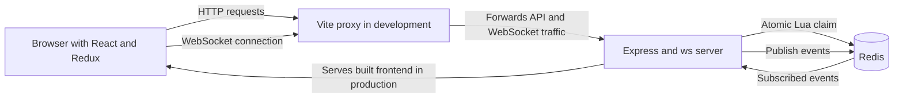
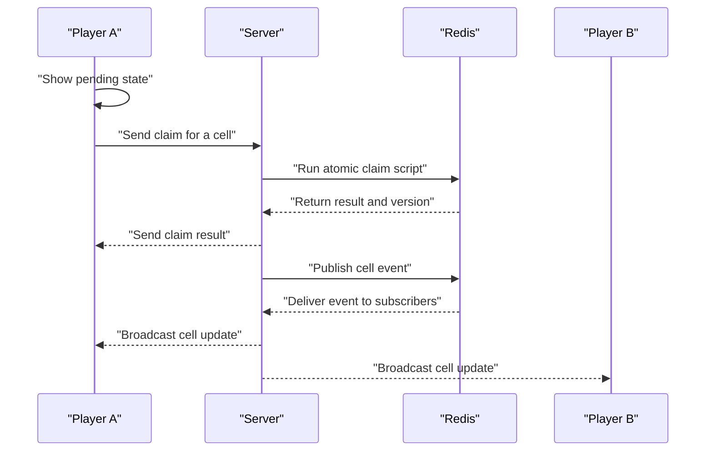
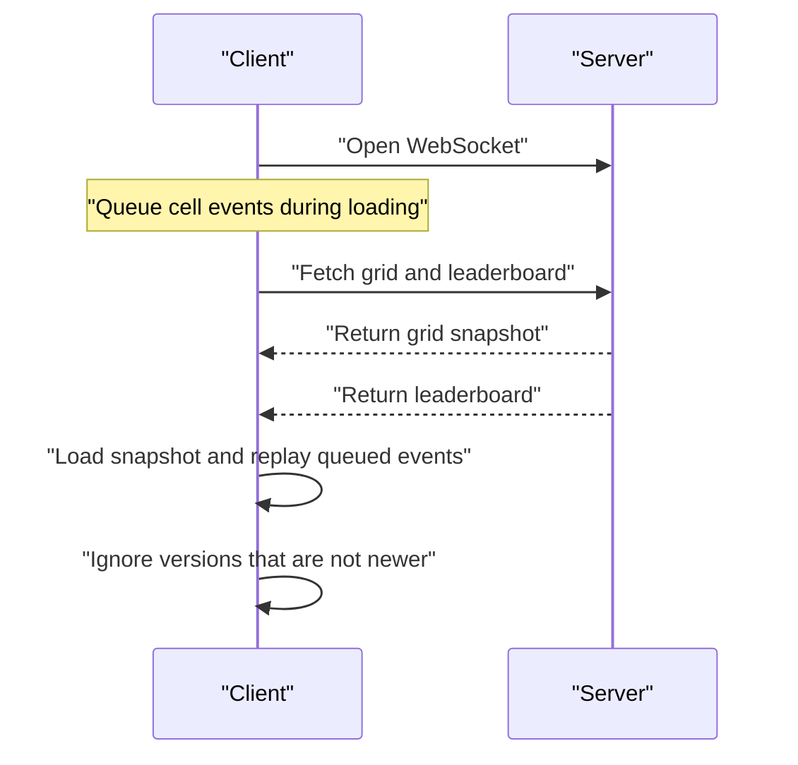

# Shared Grid

A real-time shared grid. Anyone who opens the site picks a name and a color, then
clicks cells to capture them. Captures appear for connected players. Each capture
locks its cell for 10 seconds, after which it can be captured again.


<!-- Live demo: https://... -->

## Features

- 40 × 40 board with 1,600 cells, zoom, and pan
- Live cell updates over WebSockets
- 10-second per-cell lock with a CSS countdown bar
- Atomic Redis claims: only one concurrent claim on an unlocked cell succeeds
- Pending indicator on click; ownership changes after the server confirms the claim
- Leaderboard and connected-player count
- WebSocket reconnect with backoff and a fresh grid and leaderboard sync
- Capture and rejection animations that respect `prefers-reduced-motion`

The client shows a pending state immediately but does not optimistically change a
cell's owner. With 10-second locks, rejected captures are expected; changing
ownership before confirmation would make cells flicker back on rejection.

## Running it

**Requirements:** Node.js 22+ and Docker with Compose.

```bash
# Start Redis and the development server
docker compose up -d

# Start the frontend in another terminal
cd web
npm install
npm run dev
```

Open http://localhost:5173. The Vite server proxies `/api` and `/ws` to the
Express server on port 3000.

To run the backend outside Docker while Redis is running:

```bash
cd server
npm install
npm run dev
```

The server listens on port 3000 by default. Set `PORT` to change it.

| Variable | Default | Purpose |
|---|---|---|
| `PORT` | `3000` | HTTP and WebSocket port |
| `REDIS_URL` | `redis://localhost:6379` | Redis connection |
| `STATIC_DIR` | Unset | If set, Express serves frontend files from this directory |

To build the production image, run from the repository root:

```bash
docker build -t shared-grid .
```

The [Dockerfile](./Dockerfile) builds the frontend and backend and puts both in
one image. The server serves the built frontend from `/app/web/dist`.

## Architecture



Redis stores all game state. The server does not keep a board copy in memory.
REST loads guest, grid, and leaderboard data. WebSockets carry claims and
real-time results. In development, Vite proxies the API and WebSocket paths; the
production Docker image serves the frontend and backend from one origin.

### What happens when a cell is claimed



1. The client marks the cell as pending and sends a claim message.
2. The server takes the user ID and color from the authenticated socket, not the
   message. Each socket is limited to 10 claim messages per one-second window.
3. Redis atomically checks the lock, updates cell ownership and leaderboard
   scores, and increments the global version.
4. The server replies to the claiming socket, then publishes successful cell
   changes through Redis Pub/Sub for connected clients.
5. Clients apply an update only when its version is newer than the cell's
   current version, or the loaded grid's base version.

### How a client stays in sync



The client opens the WebSocket before fetching the grid. If it fetched first,
updates between the fetch and socket connection could be missed. Events received
while loading are queued and replayed after the snapshot; the version check
ignores events already represented in that snapshot. After reconnecting, the
client fetches a fresh grid and leaderboard.

## API

### REST

| Method and path | Description |
|---|---|
| `POST /api/join` | Body `{ "name": "Ankur", "color": "#ff0000" }`. Creates a guest and returns HTTP 201 with `{ user, token }`. |
| `GET /api/grid` | Returns `{ gridSize, lockMs, serverTime, version, cells, users }`. Only claimed cells appear in `cells`; `users` maps their IDs to names and colors. |
| `GET /api/leaderboard` | Returns up to 10 entries shaped as `[{ id, name, color, count }]`. |

Join names are trimmed, 2–20 characters, and limited to ASCII letters, digits,
spaces, `_`, and `-`. Colors must match `#rrggbb`. Join is limited to 10 requests
per minute per IP; the other API routes share a limit of 120 requests per minute
per IP. Invalid join data returns HTTP 400.

### WebSocket

Connect to `/ws?token=<token>`. The server looks up the token in Redis. An
unknown token closes the socket with code `4001`.

**Client to server**

| Message | Description |
|---|---|
| `{ "type": "claim", "cellId": 42 }` | Attempts to claim an integer cell ID. Other or malformed messages are ignored. |

**Server to client**

| Type | Payload | Sent to |
|---|---|---|
| `claim_result` | On success: `{ cellId, ok: true, cell }`. On failure: `{ cellId, ok: false, reason, ownerName?, lockedUntil? }`. Reasons include `locked`, `rate_limited`, and `invalid_cell`. | Claiming socket |
| `cell` | `{ cellId, ownerId, ownerName, color, lockedUntil, version }` | Connected clients on this server instance |
| `leaderboard` | `{ top }`, with up to 10 leaderboard entries | Connected clients on this server instance |
| `online` | `{ count }`, the number of WebSocket clients on this server instance | Connected clients on this server instance |

## Redis data model

Redis is the source of truth for cells, user records, tokens, scores, and the
global version. All keys share the `{game}` hash tag.

| Key | Type | Contents |
|---|---|---|
| `{game}:grid` | Hash | Cell ID to `ownerId|color|lockedUntil` |
| `{game}:leaderboard` | Sorted set | User ID to number of cells currently owned |
| `{game}:version` | String counter | Incremented for each successful claim |
| `{game}:users` | Hash | User ID to JSON containing `name` and `color` |
| `{game}:tokens` | Hash | UUID token to user ID |
| `{game}:events` | Pub/Sub channel | Published cell and leaderboard events |

Unclaimed cells are absent from the grid hash. The server returns `gridSize` so
the client can render all 1,600 positions.

## Design decisions

**Redis is the source of truth.** The board, scores, version, users, and tokens
are stored in Redis. Server processes keep connection and rate-limit state, but
not a board copy.

**Claims use one Lua script.** The script checks the lock and updates the cell,
leaderboard, and version atomically. A separate read and write could allow
concurrent claims to both observe an unlocked cell.

**Redis supplies the lock clock.** The script reads Redis `TIME`, so different
server clocks do not determine whether a lock has expired. The grid response
includes Redis server time, which the client uses to calculate its clock offset.

**REST loads data; WebSockets carry real-time events.** Joining, loading the
grid, and loading the leaderboard use HTTP. Claims and live updates use a
persistent WebSocket connection.

**Sync opens the socket before fetching the snapshot.** This avoids losing
updates that happen between loading the grid and opening the socket. Queued
events and subsequent messages are filtered using the global version.

**Same origin instead of CORS.** Vite proxies `/api` and `/ws` during
development. In production, Express serves the frontend built into the same
Docker image as the API.

**HTTP and WebSocket limits are separate.** `express-rate-limit` limits HTTP
routes by IP. WebSocket claims use an in-memory counter per connection.

**Redux selectors are per cell.** Each memoized `Cell` component selects its own
cell from `game.cells`, so a cell update does not require every cell to select
the full board.

**The grid uses DOM and CSS Grid.** At 1,600 cells, a DOM grid keeps cell
interaction and CSS states straightforward. Lock countdowns use CSS animations
rather than a timer per cell.

**The interface was designed in Google Stitch** and implemented in the existing
React components with Tailwind CSS.

## Testing

Start Redis and the server before running the server tests:

```bash
docker compose up -d
cd server
npm test
```

The cell-store tests use Redis database 15 by default
(`TEST_REDIS_URL=redis://localhost:6379/15`) and flush that database before each
test. They cover 50 concurrent claims, lock handling, stealing after expiry,
leaderboard updates, versions, and invalid cells and colors.

The API and WebSocket tests use the running server at
`TEST_SERVER_URL=http://localhost:3000` by default. They cover join validation,
the grid response, claims and broadcasts, locked-cell rejections, concurrent
claims, the per-socket rate limit, invalid cell IDs, malformed messages, and
unknown tokens. The suite makes five join requests per run; repeated runs within
the join limiter's one-minute window can be rate limited.

Run the frontend sync tests with:

```bash
cd web
npm test
```

The seven `gameSlice` tests cover loading a grid version, stale and duplicate
events, out-of-order updates, and replacing state after reconnect.

**A bug the tests caught:** before the auth fix, three WebSocket API tests failed
while waiting for claim results: the simultaneous-claims test, the over-limit
claims test, and the invalid-cell test. Claims sent soon after a socket opened
could arrive while Redis token lookup was still pending and were discarded.
The message listener now attaches immediately, waits for authentication, and
processes queued messages in arrival order. All 19 server tests pass after the
fix.

## Known limitations

- Redis Pub/Sub does not guarantee delivery. A client that misses an event must
  reconnect and load a fresh snapshot.
- Rate-limit counters are process-local. With multiple server instances, each
  enforces its own limit, and opening more connections can bypass the
  per-connection WebSocket limit.
- Connected sockets and online counts are local to each server process. The
  online count is not cluster-wide.
- Leaderboard throttling uses a process-local timer, so separate server
  instances may each publish leaderboard updates within the same second.
- Guest UUID tokens do not expire and are sent in the WebSocket query string.
- Redis is a single point of failure.

## What I'd change at scale

- Use Redis Streams or another durable event mechanism if clients require
  guaranteed event delivery.
- Move rate limiting to shared Redis-backed state and limit connections at the
  ingress.
- Run multiple server instances behind the Kubernetes ingress with managed or
  replicated Redis; Pub/Sub forwards events to each instance's own sockets.
- Use canvas and region-based subscriptions for substantially larger maps.
- Batch cell updates to reduce message volume.
- Add token expiry and consider a different authentication exchange if it fits
  browser WebSocket constraints.

## Deployment

The app is deployed on **Kuros**, a deployment platform I built. It runs each
app as its own pod on Kubernetes in AWS EKS.

Live link: [Live link Deployed on Kuros](https://grid-student-6ab7a9d5ec6733cc96bcee22.kuros.cryboy.in)

The browser uses one origin behind the ingress for both the frontend and API.
The server sends a WebSocket ping every 30 seconds; this heartbeat is intended
to keep idle WebSocket connections alive through the ingress timeout.

## Project structure

```text
.
├── .dockerignore
├── .gitignore
├── Dockerfile
├── docker-compose.yml
├── package-lock.json
├── server
│   ├── package-lock.json
│   ├── package.json
│   ├── tsconfig.json
│   ├── src
│   │   ├── cellStore.ts
│   │   ├── config.ts
│   │   ├── index.ts
│   │   ├── realtime.ts
│   │   ├── redis.ts
│   │   └── routes.ts
│   └── test
│       ├── api.test.ts
│       └── cellStore.test.ts
└── web
    ├── index.html
    ├── package-lock.json
    ├── package.json
    ├── vite.config.js
    └── src
        ├── App.jsx
        ├── api.js
        ├── index.css
        ├── main.jsx
        ├── socket.js
        ├── components
        │   ├── Cell.jsx
        │   ├── Grid.jsx
        │   ├── JoinScreen.jsx
        │   ├── Leaderboard.jsx
        │   ├── Toast.jsx
        │   └── TopBar.jsx
        └── store
            ├── gameSlice.js
            ├── gameSlice.test.js
            ├── store.js
            └── userSlice.js
```

## Tech stack

**Frontend:** React, Vite, Tailwind CSS v4, Redux Toolkit  
**Backend:** Node.js 22+, TypeScript, Express, `ws`, `express-validator`,
`express-rate-limit`  
**Data:** Redis 7, Lua scripting, Pub/Sub, sorted sets  
**Testing:** Vitest
